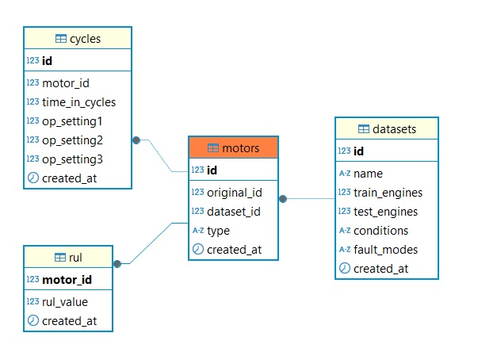
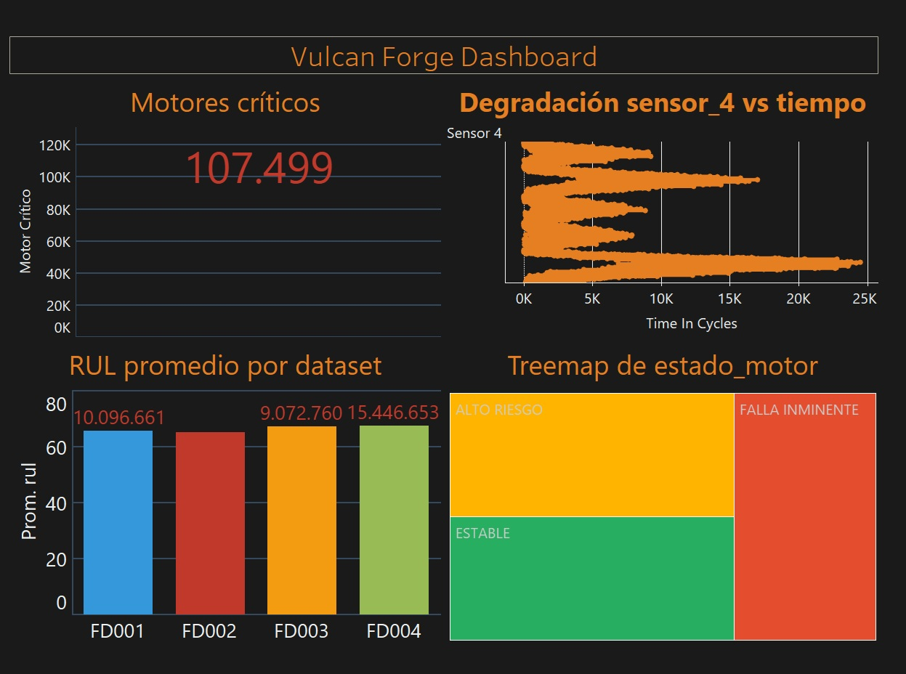
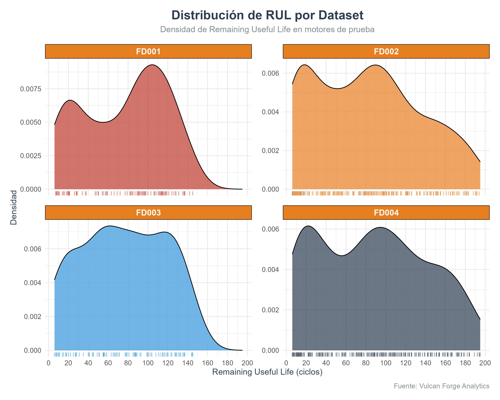
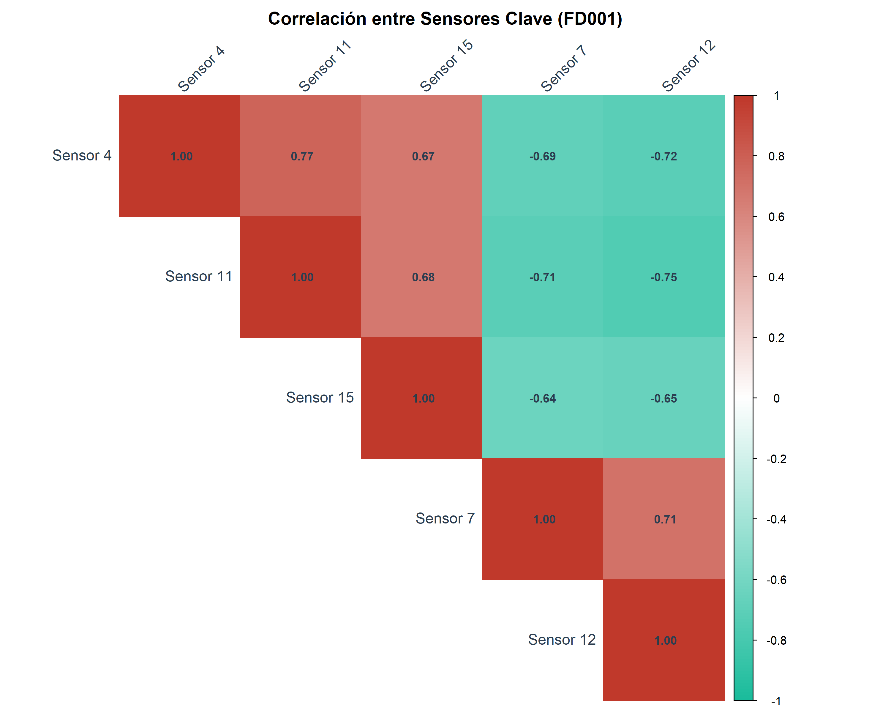

# 🔥 VULCAN FORGE

**Predictive Maintenance for Manufacturing Excellence**  
*Forjando inteligencia operativa a través del fuego de los datos*


---

## 📌 Contenido

- [🏭 Dominio del Proyecto](#-dominio-del-proyecto)
- [🎯 Objetivos](#-objetivos)
- [🗂️ Estructura del Proyecto](#️-estructura-del-proyecto)
- [🚀 Primeros Pasos](#-primeros-pasos)
- [🧠 Tecnologías Utilizadas](#-tecnologías-utilizadas)
- [📈 Resultado Esperado](#-resultado-esperado)
- [📄 Tablas e insights en HTML](#-tablas-e-insights-en-html)
- [📊 Gráficos EDA](#-gráficos-eda)
- [📚 Recursos](#-recursos)
- [🤝 Contribuciones](#-contribuciones)
- [🧾 Conclusión](#-conclusión)
- [🧠 Lecciones Aprendidas](#-🧠-Lecciones-Aprendidas)
- [📬 Contacto](#-contacto)

---

[](LICENSE)
[](https://www.python.org/)
[]()
[]()

---

## 🏭 Dominio del Proyecto

**Vulcan Forge** es una solución de mantenimiento predictivo basada en aprendizaje automático, enfocada en el monitoreo de salud de motores turbofan. Usamos el dataset [CMAPSS de NASA](https://www.nasa.gov/intelligent-systems-division/discovery-and-systems-health/pcoe/pcoe-data-set-repository) para simular condiciones reales y optimizar decisiones en el entorno industrial.

---

## 🎯 Objetivos

- 🔍 Detectar patrones de fallo en motores mediante sensores.
- 📉 Predecir el ciclo de vida restante (RUL) de cada motor.
- 🛠️ Facilitar el mantenimiento preventivo con dashboards e insights visuales.
- 💾 Normalizar y estructurar los datos en una base de datos relacional (PostgreSQL).
- 📊 Visualizar resultados mediante gráficos y vistas SQL inteligentes.

---

## 🗂️ Estructura del Proyecto

```bash
├──.gitignore
├── README.md
|   
├──.github
|   └───workflows
|           python─package─conda.yml
|           
├───data
|   ├───cleaned
|   |       RUL_FD001.csv
|   |       RUL_FD002.csv
|   |       RUL_FD003.csv
|   |       RUL_FD004.csv
|   |       test_FD001.csv
|   |       test_FD002.csv
|   |       test_FD003.csv
|   |       test_FD004.csv
|   |       train_FD001.csv
|   |       train_FD002.csv
|   |       train_FD003.csv
|   |       train_FD004.csv
|   |       
|   └───raw
|           6.+Turbofan+Engine+Degradation+Simulation+Data+Set.zip
|           Damage Propagation Modeling.pdf
|           links.csv
|           page.html
|           readme.txt
|           RUL_FD001.txt
|           RUL_FD002.txt
|           RUL_FD003.txt
|           RUL_FD004.txt
|           test_FD001.txt
|           test_FD002.txt
|           test_FD003.txt
|           test_FD004.txt
|           train_FD001.txt
|           train_FD002.txt
|           train_FD003.txt
|           train_FD004.txt
|           
├───documentos
|   |   Analisis 5 Whys.html
|   |   Analisis Exploratorio de Datos (EDA).html
|   |   insigth_vulvan_forge.html
|   |   Preguntas SMART.html
|   |   Resultado Analisis exploratorio (EDA).html
|   |   sow.html
|   |   
|   ├───graficos_eda
|   |       01_distribucion_rul.png
|   |       02_evolucion_sensores.png
|   |       03_correlacion_sensores.png
|   |       04_opsetting1_vs_rul.png
|   |       05_opsetting2_vs_rul.png
|   |       06_opsetting3_vs_rul.png
|   |       07_vida_util_motores.png
|   |       08_sensores_falla.png
|   |       
|   └───tablas
|           01_estadisticas_rul.html
|           
├───imagenes
|       tablas_normalizadas.jpg
|       vulcan_dashboard.jpg
|       
├───notebooks
|       01_descarga_dataset.ipynb
|       02_transform_raw_to_clean.ipynb
|       03_validacion_datos_limpios.ipynb
|       04_exploracion_datos_limpios.ipynb
|       05_Insertar_datos.ipynb
|       
├───scripts
|   |   .RData
|   |   .Rhistory
|   |   01_descarga_dataset.py
|   |   02_transform_raw_to_clean.py
|   |   03_creacion_database.sql
|   |   04_crear_tablas.py
|   |   05_Insertar_datos.py
|   |   06_creacion_tablas_normalizado.sql
|   |   07_normalizado_tablas.py
|   |   08_analisis_EDA.R
|   |   09_creacion_tablas_dashboard.sql
|   |   hidden1.py
|   |   hidden1.R
|   |   
|   ├───tablas
|   |       01_estadisticas_rul.html
|   |       
|   └───__pycache__
|           hidden1.cpython─313.pyc
|           
└───visualizaciones
    |   vulcan_dashboard.twb
    |   
    └───data_export
            vulcan_dashboard.csv
```

---

## 🚀 Primeros Pasos

### 1. Clona este repositorio

```bash
git clone https://github.com/ImCamilo2103/vulcan_forge.git
cd vulcan_forge
```

### 2. Crea un entorno virtual e instala las dependencias

```bash
python -m venv venv
source venv/bin/activate  # En Windows: venv\Scripts\activate
pip install -r requirements.txt
```

### 3. Ejecuta los scripts en orden lógico

```bash
python  scripts/01_descarga_dataset.py
python  scripts/02_limpieza_datos.py
dbeaver 03_creacion_database.sql
python  scripts/04_crear_tablas.py
python  scripts/05_Insertar_datos.py
dbeaver scripts/06_creacion_tablas_normalizado.sql
python  scripts/07_normalizado_tablas.py
rstudio scripts/08_analisis_EDA.R
dbeaver scripts/09_creacion_tablas_dashboard.sql
```

---

## 🧠 Tecnologías Utilizadas

*  **Python** 🐍 (Pandas)
* **PostgreSQL** 🐘
* **SQL** para consultas analíticas
* **Git + GitHub** para control de versiones
* **Tableau / Power BI** para dashboards

---

## Imagen de Tablas Normalizadas

  
*Modelo relacional en 3NF para almacenar datos de sensores y ciclos.*

---

## 📈 Resultado Esperado

* 🔮 Predicción del ciclo de vida restante (RUL) para cada motor
* 📌 Insights sobre sensores críticos
* 📊 Dashboards interactivos
* 🧩 Base de datos normalizada en 3NF



[](https://public.tableau.com/views/vulcan_dashboard/VulcanDasboard?:language=es-ES&publish=yes&:sid=&:redirect=auth&:display_count=n&:origin=viz_share_link)

---

## 📄 Tablas e insights en HTML

- 📑 [SOW - Alcance del Proyecto](documentos/sow.html)
- 🔍 [Preguntas SMART](documentos/Preguntas%20SMART.html)
- 🧠 [Análisis 5 Whys](documentos/Analisis%205%20Whys.html)
- 👓 [Pre-Analisis](documentos/Analisis%20Exploratorio%20de%20Datos%20(EDA).html)
- 📊 [Estadísticas de RUL](documentos/Resultado%20Analisis%20exploratorio%20(EDA).html)
- 💡 [Insights Vulcan Forge](documentos/insigth_vulvan_forge.html)

---

## Gráficos EDA

  
*FD003 muestra la mayor vida útil residual promedio*

  
*Sensor 4 cambia drásticamente antes de la falla*

  
*Sensor_4 tiene la mayor correlación negativa con el RUL.*

---

## 📚 Recursos

* 📘 [NASA CMAPSS Dataset](https://data.nasa.gov/dataset/C─MAPSS─Aircraft─Engine─Simulator-Data/xaut─bemq)
* 📑 [Documentación de PostgreSQL](https://www.postgresql.org/docs/)
* 📦 [Scikit─learn](https://scikit-learn.org/stable/)
* 📈 [Visualizaciones en Tableau](https://public.tableau.com/)

---

## 🤝 Contribuciones

¿Te gustaría mejorar este proyecto o usarlo en otro dominio? ¡Eres bienvenido!

1. Haz un fork 🍴
2. Crea tu rama (`git checkout -b feature/nueva-funcionalidad`)
3. Haz commit de tus cambios (`git commit -m 'Nueva función'`)
4. Haz push a tu rama (`git push origin feature/nueva-funcionalidad`)
5. Abre un Pull Request 🚀

---

## 🧾 Conclusión

**Vulcan Forge** demuestra cómo la analítica avanzada puede transformar la operación industrial mediante el uso de sensores, predicción de fallas y dashboards inteligentes. Este proyecto es una base sólida para escalar a modelos de mantenimiento predictivo en entornos reales de manufactura.

---

## 🧠 Lecciones Aprendidas

- Automatización del flujo ETL con SQL y Python
- Integración de análisis estadístico en R con visualización en Tableau
- Optimización de vistas SQL para dashboards de alto volumen
- Conexión de PostgreSQL a herramientas BI

---

## 📬 Contacto

Desarrollado por **Camilo Garzón Moreno**  
[](https://www.linkedin.com/in/camilo-garzón-81422331)

---

> **"La inteligencia no sustituye el esfuerzo. Pero el esfuerzo con inteligencia lo forja todo."**
